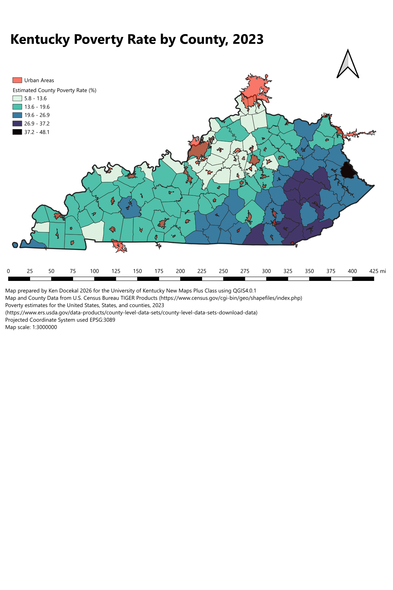
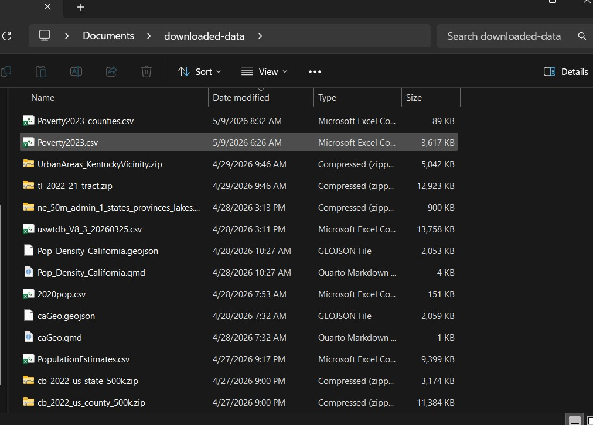
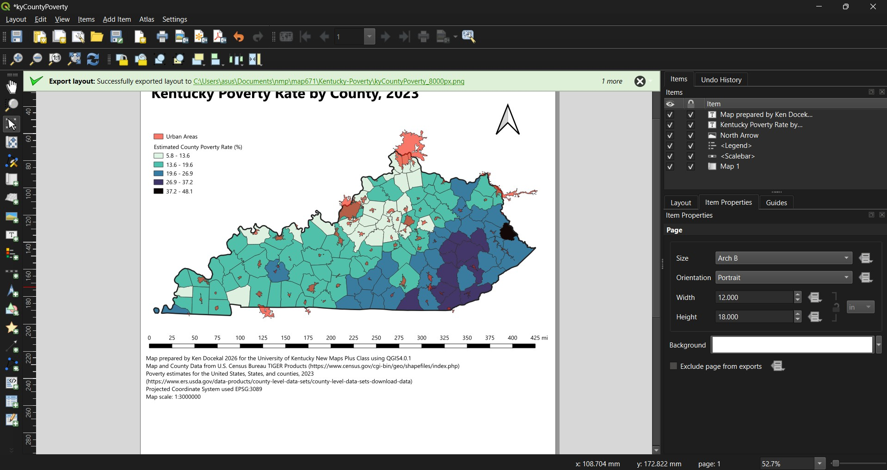

# Kentucky-Poverty

## Project Contents

- [Data Source](#data-source)
- [Project Background](#project-background)
- [Purpose](#purpose)
- [Mapmaking Process](#mapmaking-process)
- [Map Summary](#map-summary)

***

### Data Source

State and County data can be found here: [Link to US Census data](https://www.census.gov/cgi-bin/geo/shapefiles/index.php)

Poverty data can be found here: [Link to US Department of Agriculture data](https://www.ers.usda.gov/data-products/county-level-data-sets/county-level-data-sets-download-data)

* Initial Data projection: EPSG:4269 - NAD83
* Final Map projection: EPSG:3089 - NAD83 / Kentucky Single Zone (ftUS)

### Project Background

This map draws from US Census and US Department of Agriculture data to show the distribution of poverty rates by county and urban areas in Kentucky.

### Purpose

Providing a geographic represetation of the distribution of poverty rates by county and urban areas in Kentucky enables audiences to observe how poverty is distrubuted across the state and how this distribution aligns with the location of urban areas. This can be helpful for public policy planning as policy officials can use this map to help better understand the environmental conditions and potential proximity to services for Kentucky residents in areas of varying poverty levels.

### Mapmaking Process

1. Download data from above sources and store in your downloads folder.

2. Upload census files as a vector layer then transform the poverty .csv file, upload as a deliminated text layer then join to the previous layer. 
3. Filter for Kentucky. Then edit symbology to create only the Kentucky outline, county outlines, and semi-transparent urban areas.  
4. Edit fill symbology changing it to a graduated based on percent poverty 2023 with Jenks and select an appropriate color ramp.
5. Create a new print layout of your desired dimenstions, save the existing map adding a legend, scale bar, compass, title, and description. 

### Map Summary

Key findings from my map shows that poverty in Kentucky is most concentrated in eastern counties. We can see that most of these counties are predominantly rural, as they mostly lack large urban areas, especially compared with more northern, central, and western counties. Counties nearest the largest urban areas are shown to have the lowest poverty rates. 

This mapping process helped me apprechiate the importance of color choice. Here picking the right color combination was not only important for clearly representing the relative distribution of poverty in Kentucky but my chosen color gradient had to also be compatible with showing urban areas simultaneously as well. My final choice is a scheme I think represents both clearly as the red of urban areas contrasts well with all colors representing different poverty levels. 

## Final Project Link

Please view the [final map online](https://kdocekal.github.io/Kentucky-Poverty)